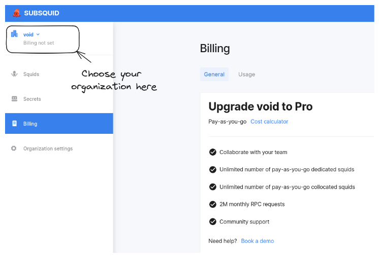

# Organizations

All squids within Subsquid Cloud are grouped into *organizations*. This additional layer of hierarchy enables team access and per-team billing. It also prevents unnecessary data sharing, as [environment variables](../env-variables) are separate between organizations.

To create an organization, click on the organizations dropdown menu in the upper left corner of the [Cloud homepage](https://app.subsquid.io/) and select "Create new organization".


## Playgrounds

A playground organization is created for each account on its first login. There, you can deploy one squid for development or prototyping, free of charge.

Playground squids cannot be used in production, as they are [collocated](/cloud/reference/scale/#dedicated) and run on [spot VMs](https://cloud.google.com/spot-vms). Expect 3-5 minutes of downtime once every few days. Other limitations include:
 - 10 GB of database storage;
 - 500k monthly requests to the [RPC proxy](/cloud/reference/rpc-proxy) service.

Unlike other organizations, playgrounds cannot be shared or billed. 

## Draft organizations

Freshly created organizations are marked as drafts until upgraded to Professional status. It is not possible to deploy squids to draft organizations, but you can invite other users into them and set [environment variables](../env-variables).

## Professional organizations

Adding a valid payment method promotes an organization to Professional status. Visit [the billing page](https://app.subsquid.io/billing), select your organization in the dropdown menu in the top left corner and follow the upgrade instructions:



Once an organization is upgraded you can deploy as many squids as you requre. [`scale:` section](/cloud/reference/scale) is now unlocked: use it to request any resources suitable for your use case. Your organization will be billed according to our [pricing schedule](/cloud/reference/pricing).

## Working with organizations

When your account has access to more than one organization, it is necessary to specify one when [listing](/squid-cli/ls), [exploring](/squid-cli/explorer) or [deploying](/squid-cli/deploy) (with some exceptions) your squids, as well as when [setting environment variables/secrets](/squid-cli/secrets). Do it with the `--org/-o` flag:

```bash
sqd secrets ls -o my-organization
sqd secrets rm SECRET --org my-organization
sqd secrets set SECRET --org my-organization

sqd ls -o my-organization
sqd explorer -o my-organization
sqd deploy . -o my-organization
```

If you omit the flag, `sqd` will ask you to choose an organization interactively.
